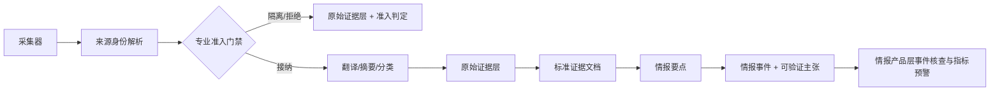

# 专业情报分层架构

本文描述当前已经落地的原始证据层、标准证据层和情报产品层主链。系统目标不再是“尽可能多地保存新闻”，而是把采集内容转换成可审计、可验证、可形成预警的情报产品。

## 1. 设计原则

1. **原始证据层不可变**：原始证据只追加，不因分类、翻译或回填而改写。
2. **先准入，后加工**：来源分级和指标匹配先于翻译、摘要、大语言模型分类，隔离项不消耗昂贵处理资源。
3. **来源不是作者**：`source_key` 表示媒体、机构、频道或平台社区；作者单独保存，不能用作者名虚增信源数。
4. **事件先于文章**：仪表盘和预警消费情报产品层事件，不把单篇报道直接当作已确认事实。
5. **转载不等于交叉验证**：相同 `independence_group` 的转载、镜像和同一通讯社稿件只计一个独立信源。
6. **结论可回溯**：情报事件 → 可验证主张 → 情报要点 → 标准证据文档 → 原始证据文档，全链路均可定位。

## 2. 端到端流程



采集器有两条运行入口：`HorizonBridge` 和 Agent Collector。二者共用同一套来源解析、准入、持久化逻辑，不允许各自维护不同的质量规则。

## 3. 来源策略

### 3.1 来源等级

| 等级 | 典型来源 | 默认用途 |
|---|---|---|
| `primary` | 政府、监管机构、国际组织、官方公告 | 可作为高质量单源证据，但仍需区分“官方声明”与“事实已独立确认” |
| `professional` | 通讯社、专业媒体、行业情报、研究机构 | 进入指标匹配和事件归并 |
| `local` | 地区媒体、本地专业来源 | 补充现场与地区语境 |
| `social` | Reddit、Telegram、Twitter/X | 只作线索；未经外部验证不能直接形成告警 |
| `knowledge` | 教程、通用技术博客、Hacker News | 默认不采；启用时只进入原始证据层隔离审计 |
| `unknown` | 无法识别的来源 | 保守评分，不能因作者名看似可信而升级 |

默认 RSS 集合排除 `bestblogs`、泛 AI、通用技术和泛加密资讯；Hacker News 与通用 GitHub Release 采集默认关闭。确有知识采集需求时，显式设置：

```bash
OSINT_INCLUDE_KNOWLEDGE_FEEDS=1
```

### 3.2 规范来源身份

来源登记器（内部类名 `SourceRegistry`）输出：

| 字段 | 说明 |
|---|---|
| `source_key` | 稳定来源标识，例如 `reuters`、`reddit:worldnews` |
| `display_name` | 展示名称 |
| `tier` | 来源等级 |
| `reliability` | Admiralty 风格来源可靠性 `A-E` |
| `independence_group` | 独立性分组；同组证据只计一个独立信源 |
| `domain` | 来源关注领域 |
| `author` | 作者；不参与来源计数 |

## 4. 专业准入门禁

准入判定引擎（内部类名 `AdmissionEngine`）使用确定性规则，不依赖大语言模型。每条内容均产生一条准入判定记录：

- `accepted`（已接纳）：命中受控的优先情报需求和指标预警规则，内容量和来源质量达到阈值；进入后续加工并生成标准证据层与情报产品层记录。
- `quarantined`（已隔离）：保留证据和原因，但不生成情报要点、事件或告警。
- `rejected`（已拒绝）：空文档等无可用证据的输入。

当前接纳阈值为 `0.75`。评分由来源等级、预警指标、内容完整性、影响、紧迫性和具体事实信号组成；知识源最高限制为 `0.49`，未经验证的社交源最高限制为 `0.54`，未登记来源最高限制为 `0.69`。中英文受控指标覆盖：

- 军事演习、空域关闭与 NOTAM；
- 出口管制、禁运、关税与关键矿产；
- 网络攻击、勒索软件与关键基础设施中断；
- 能源断供、管道/炼厂停运与大范围停电；
- 地震、海啸、火山、洪水和山火疏散；
- 紧急利率、资本管制、挤兑、违约和汇率干预；
- 公共卫生紧急状态、疫情和隔离令；
- 政治突变、政变、紧急状态和大规模社会动荡；
- 港口、航运、运河、铁路货运中断；
- 农业、粮食安全和技术出口限制。

所有判定原因、优先情报需求、预警指标、得分和来源等级写入 `collection_decisions`，可通过 `/api/intelligence/quality` 审计总体接纳率。

## 5. 原始证据层：不可变证据

原始证据层仍使用按日期和来源分区的 JSON 文件及 `_index.db`。机器契约见 [`raw-document.schema.json`](../schemas/raw-document.schema.json)。

新采集文档的 `extensions` 增加：

| 字段 | 说明 |
|---|---|
| `source_profile` | 规范来源、等级、可靠性、独立性分组和作者 |
| `intelligence_admission` | 状态、得分、原因、优先情报需求、预警指标、事件类型、影响和紧迫性 |
| `original_title`, `original_content` | 翻译/摘要前的原始文本 |
| `horizon_metadata` | 采集器原始元数据 |

隔离内容仍写入原始证据层，因此质量门禁不会造成证据丢失；它只阻止无效内容进入下游产品和告警。

## 6. 标准证据层：规范化证据

当前标准证据层热路径持久化在 `bronze_storage/_intelligence.db` 的 `silver_documents` 表：

| 字段 | 说明 |
|---|---|
| `silver_document_id` | 基于 `raw_document_id` 的稳定 UUID |
| `raw_document_id` | 唯一原始证据血缘 |
| `canonical_text`, `title` | 标准正文和标题 |
| `published_at` | 来源发布时间 |
| `source_key`, `author`, `url`, `language` | 规范来源和证据属性 |

机器契约见 [`silver-document.schema.json`](../schemas/silver-document.schema.json)。实体、关系和实体消歧 schema 仍保留为扩展面；当前热路径不声称已经完成实体解析。

## 7. 情报产品层：情报要点、事件、主张和预警

### 7.1 情报要点

情报要点是通过门禁后的最小可操作陈述，契约见 [`intelligence-point.schema.json`](../schemas/intelligence-point.schema.json)。核心字段包括：

- `event_type`, `layer`, `statement`；
- `impact`, `urgency`, `relevance_score`；
- `source_reliability`（A-E）与 `information_credibility`（1-6）；
- `independence_group`；
- `pir_ids`, `indicator_ids`；
- 标准证据文档与情报事件血缘。

### 7.2 情报事件

同一事件类型、图层、日期和规范标题归并为一个事件。契约见 [`event.schema.json`](../schemas/event.schema.json)。事件维护证据数、独立信源数和 L1-L4 评级：

| 等级 | 当前判定 |
|---|---|
| `L1` | 至少 3 个独立信源，且其中至少 2 个为 A/B 可靠来源 |
| `L2` | 至少 2 个独立信源且包含 A/B 来源；或 3 个以上低可靠独立来源 |
| `L3` | 1 个 A/B 来源；或 2 个尚未达到高可靠门槛的独立来源 |
| `L4` | 只有低可靠或待核验单源 |

这里的“独立”以 `independence_group` 去重；两家镜像站转载同一 Reuters 稿件时，证据数为 2，但独立信源数仍为 1。

### 7.3 可验证主张

每个接纳文档形成一条可验证主张，契约见 [`claim.schema.json`](../schemas/claim.schema.json)。单源时为 `unverified`（待核查）；事件达到两个独立信源后更新为 `supported`（已获支持）。`disputed`（存在争议）和 `refuted`（已被反驳）已进入机器契约，待反证工作流写入。

### 7.4 查询与展示

| API | 用途 |
|---|---|
| `GET /api/intelligence/events` | 直接读取情报产品层事件 |
| `GET /api/intelligence/warnings` | 从已评级事件派生指标与预警 |
| `GET /api/intelligence/points` | 情报点和证据血缘 |
| `GET /api/intelligence/quality` | 接纳率、隔离率、来源等级和 L1-L4 分布 |
| `GET /api/analysis/events` | 情报产品层优先；无情报产品数据时兼容旧事件聚类 |
| `GET /api/analysis/warnings` | 情报产品层优先；无情报产品数据时兼容旧预警算法 |

前端“情报分析”默认打开事件核查视图。消息流会排除明确隔离和 `unclassified` 内容，避免内部噪声桶成为用户可见图层。

## 8. 历史数据迁移

回填只读取原始证据层，不修改任何原始 JSON：

```bash
./.venv/bin/python scripts/backfill_intelligence.py
```

常用参数：

```bash
# 先抽样验证 1000 条
./.venv/bin/python scripts/backfill_intelligence.py --limit 1000
```

脚本可重复运行，并跳过已经存在 `collection_decisions` 的文档。输出 `scanned / accepted / quarantined / rejected / skipped / errors`，便于部署前核验。若规则发生不兼容升级，应先备份并通过版本化迁移重建 Intelligence 数据库，不能用增量回放混合两套判定语义。

## 9. 数据质量与运行检查

最低检查项：

1. `acceptance_rate` 不能长期接近 0 或 1；两者都意味着规则失真。
2. 高影响 L1/L2 事件必须能列出全部 evidence 和独立信源分组。
3. `quarantined` 文档不能出现在 `intelligence_points`、`events` 或告警接口。
4. 原始证据文件回填前后哈希和内容必须一致。
5. 默认采集配置不得重新启用通用知识源；启用必须通过显式环境变量。
6. 规则、来源目录或事件归并逻辑变更后，必须运行专业链路、后端和前端回归测试。

## 10. 当前边界

- 当前事件键是确定性的“事件类型 + 图层 + 日期 + 规范标题”。它可防止任意主题误合并，但对跨语言改写和长时间演化事件仍较保守。
- 实体解析、地理实体消歧、反证自动写入和 SCD2 版本化尚未进入热路径；相关 schema 是下一阶段扩展点。
- SQLite 适合当前单机部署；迁移到多写入节点前，应将同一表契约迁至 PostgreSQL/湖仓，并保持原始证据血缘不变。
