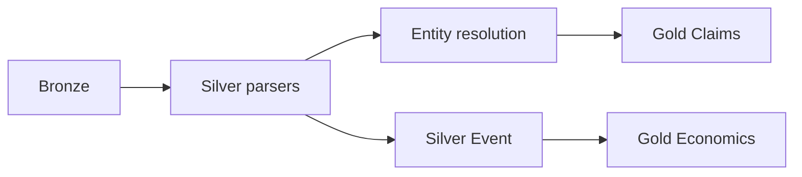

# Bronze / Silver / Gold 与核心对象模型

## 1. 分层语义

| 层 | 目的 | 可变性 | 典型存储 |
|----|------|--------|----------|
| **Bronze** | 不可变原始证据 | Append-only；禁止原地更新 | 对象存储 + 元数据表 |
| **Silver** | 清洗、去重、实体解析、时间/语言规范化 | 版本化更新（新快照或 SCD2） | 湖仓表 |
| **Gold** | 主题、指标、面向分析与告警的视图 | 批/流派生，可重建 | 湖仓表 + 索引投影 |

**血缘**：每条 Silver/Gold 记录保留 `lineage`：`raw_document_id[]` 或 `silver_document_id`。

## 2. Bronze 表（逻辑）

### 2.1 `bronze_raw_document`

与 [`raw-document.schema.json`](../schemas/raw-document.schema.json) 对齐，额外字段：

| 字段 | 说明 |
|------|------|
| `ingested_at` | 进入湖仓时间 |
| `partition_date` | 按 `captured_at` 日期分区 |

原始字节仅存对象存储；表内存 `body_ref` 与哈希。

## 3. Silver 核心对象

### 3.1 `silver_document`

从 Bronze 解析出的**逻辑文档**（一篇新闻、一条帖子、一条 API 记录）。

| 字段 | 类型 | 说明 |
|------|------|------|
| `silver_document_id` | UUID | 主键 |
| `canonical_text` | text | 清洗后正文 |
| `language` | string | ISO 639-1 + 可选地区 |
| `published_at` | timestamptz | 尽可能从正文/元数据解析 |
| `title` | text | 可空 |
| `raw_document_ids` | array<UUID> | 溯源 |
| `dedupe_fingerprint` | string | 跨源去重用 |
| `pii_flags` | array<string> | 检测标签 |

### 3.2 `silver_entity`

| 字段 | 类型 | 说明 |
|------|------|------|
| `entity_id` | UUID | 规范 ID |
| `entity_type` | enum | `Person`, `Organization`, `Location`, `Instrument`, `Other` |
| `canonical_name` | text | 展示名 |
| `aliases` | array<text> | 别名 |
| `external_ids` | jsonb | `wikidata`, `lei`, `isin` 等 |
| `confidence` | float | 0–1 |
| `merged_from` | array<UUID> | 实体合并历史 |

### 3.3 `silver_document_entity`

多对多：文档中出现的实体提及。

| 字段 | 说明 |
|------|------|
| `silver_document_id`, `entity_id` | 复合键 |
| `mention_span` | 起始/结束字符或 token 偏移 |
| `role` | 可选：`subject`, `object`, `location` |

### 3.4 `silver_event`

| 字段 | 类型 | 说明 |
|------|------|------|
| `event_id` | UUID | 主键 |
| `event_type` | string | 受控词表：并购、制裁、财报、政策发布等 |
| `event_time` | timestamptz | UTC |
| `location_entity_id` | UUID | 可空 |
| `participant_entity_ids` | array<UUID> | 可空 |
| `source_silver_document_ids` | array<UUID> | 溯源 |

## 4. Gold 层（主题与指标）

### 4.1 `gold_claim`

支撑验真与多智能体推理的**可验证陈述**。

| 字段 | 类型 | 说明 |
|------|------|------|
| `claim_id` | UUID | 主键 |
| `statement` | text | 规范化陈述句 |
| `silver_document_id` | UUID | 主证据文档 |
| `evidence_span` | jsonb | `{start, end}` 或 token 范围 |
| `verification_status` | enum | `unverified`, `supported`, `disputed`, `refuted` |
| `confidence` | float | 聚合后置信度 |

### 4.2 `gold_economic_indicator_snapshot`（经济主题示例）

| 字段 | 说明 |
|------|------|
| `snapshot_id` | UUID |
| `indicator_key` | 如 `FX_USDCNY`, `TRADE_VOLUME` |
| `observed_at` | 时间点 |
| `value` | numeric |
| `unit` | string |
| `entity_refs` | 关联 `entity_id` |
| `source_silver_document_ids` | 溯源 |

### 4.3 `gold_event_enriched`

Silver 事件 + 聚合标签 + 风险/经济影响草稿（供 Agent 与仪表盘）。

## 5. 处理流水线

- **实时**：Bronze 写入触发流任务生成最小 Silver 行。
- **批**：每日实体解析、去重合并、Gold 聚合与回填。

## 6. Schema Registry

- 所有 JSON/Avro/Protobuf 字段变更登记版本号；**禁止**无版本号的列语义变更。
- 参考机器可读片段：[`../schemas/silver-document.schema.json`](../schemas/silver-document.schema.json)、[`../schemas/entity.schema.json`](../schemas/entity.schema.json)、[`../schemas/event.schema.json`](../schemas/event.schema.json)、[`../schemas/claim.schema.json`](../schemas/claim.schema.json)。

## 7. 可选知识图谱

当需推理供应链、控股关系时，将 `silver_entity` 与关系边 `silver_relation(edge_type, from_id, to_id, evidence_doc_ids)` 同步到图数据库；Gold 层可投影为图上的**派生属性**。
