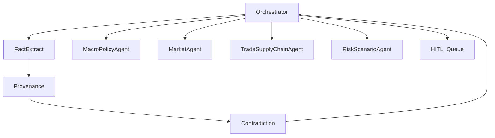

# 智能体平面：编排、验真、经济垂直与人机闸门

## 1. 目标

- 将标准证据层和情报产品层数据转化为**可审计**的可验证主张与分析产物；**禁止**无来源的“裸结论”。
- 经济维度作为首个深化垂直，输出**情景化**简报与指标引用，而非单点武断预测。

## 2. Orchestrator（编排器）

### 2.1 职责

| 能力 | 说明 |
|------|------|
| 任务分解 | 将用户或系统触发拆为：抽取可验证主张、验真、翻译、经济专题分析 |
| 路由 | 按 `topic`、`language`、`tenant_policy` 选择子智能体 |
| 合并 | 多 Agent 冲突时输出**分歧说明**与证据列表，不强行单选 |
| 置信度聚合 | 对 `claim.confidence` 采用可配置策略（最小值、加权、贝叶斯占位） |

### 2.2 输入输出（概念）

- **输入**：`silver_document_id` 或 `event_id`、可选 `focus=economics`。
- **输出**：更新的 `gold_claim` 行、经济简报结构体 `EconomicBrief`（见下）、审计日志 `agent_trace_id`。

### 2.3 工具边界

Orchestrator 可调用的工具仅限：

- `search_internal_docs`（RAG，限定已入库文档）
- `get_entity`、`list_events_for_entity`
- `update_claim_verification`（写库需权限角色）

**不可**默认调用开放互联网搜索作为事实依据 unless 配置显式开启且结果仍写入 `supporting_silver_document_ids` 或外部引用经合规审查。

## 3. 验真链路（横向 Agents）

| Agent | 输入 | 输出 |
|-------|------|------|
| **事实抽取** | `silver_document` | 候选可验证主张 + `evidence_span` |
| **来源追溯** | 可验证主张 | 库内多文档检索，候选 `supporting_silver_document_ids` |
| **矛盾检测** | 可验证主张 + 支持文档集 | `verification_status` 建议、`dispute_notes` |

验真结果**必须**写回 `gold_claim`，不得仅存于对话。

## 4. 经济垂直子智能体

| 智能体编号 | 职责 | 主要情报产品层/标准证据层输入 |
|----------|------|------------------------|
| `MacroPolicyAgent` | 央行/财政部/国际机构政策文本与宏观数据解读 | `silver_document`（政策类）、`gold_economic_indicator_snapshot` |
| `MarketAgent` | 资产价格、波动与公告联动 | 指标快照、公司公告 `silver_document` |
| `TradeSupplyChainAgent` | 贸易流、航运与供应链实体 | `silver_entity`、`silver_event`、贸易相关文档 |
| `RiskScenarioAgent` | 地缘与政策冲击的**情景**与传导链 | 事件 + 实体图（若启用） |

### 4.1 EconomicBrief（JSON 形状，建议）

```json
{
  "brief_id": "uuid",
  "tenant_id": "string",
  "focus": "economics",
  "scenarios": [
    {
      "name": "baseline",
      "summary": "string",
      "cited_claim_ids": ["uuid"],
      "confidence": 0.0
    }
  ],
  "indicators_touched": ["FX_USDCNY"],
  "limitations": ["string"]
}
```

## 5. 人工复核闸门（HITL）

进入人工队列的条件（可配置）：

- `claim.confidence` < 阈值；
- `verification_status = disputed`；
- `classification` ∈ {`PII`, `RESTRICTED`}；
- 用户标记「高影响」工作流。

队列状态机：`pending` → `assigned` → `approved` / `rejected`；**审计**操作者与备注。

## 6. 交互图



## 7. Prompt 与策略版本

- 每个 Agent 绑定 `prompt_version` 与 `model_id`；输出随 `agent_trace` 持久化以便复现。
- 经济类输出须包含 **limitations** 字段，避免过度确定表述。
