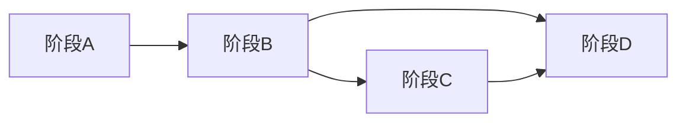

# 递进式落地路线图（阶段 A → D）

## 阶段 A — 骨架（MVP）

**目标**：端到端可演示，合规与审计字段齐全。

| 工作项 | 交付 |
|--------|------|
| 渠道 | 1–2 个低风险源（如 RSS、公开 REST API），使用 [api-adapter](../collectors/api-adapter.md) 或极简 Web |
| 数据 | 原始证据表 + `silver_document` 最小字段；可选暂不建实体 |
| 队列 | `jobs.pending` → `raw.ingest` → 写库；基础 DLQ |
| 智能体 | 单 Orchestrator + FactExtract + 一条验真路径（可 mock Provenance） |
| 运维 | 日志、`correlation_id`、采集器版本与哈希 |

**退出标准**：单次任务可从调度到原始证据层可查，并生成至少一条 `gold_claim` 可验证主张（或标记为 `unverified`，即待核查）。

## 阶段 B — 归一化加深

**目标**：可分析、可检索、可去重。

| 工作项 | 交付 |
|--------|------|
| 标准证据层 | 实体表、去重指纹、基础命名实体识别/链接（规则或模型） |
| 情报产品层 | `silver_event`、仪表盘查询；OpenSearch 投影 |
| 告警 | 基于关键词/实体 watchlist 的简易告警 |

**退出标准**：跨两篇文档的同一公司能指向同一 `entity_id`（抽样验收）。

## 阶段 C — 经济垂直

**目标**：经济类数据源与多 Agent 协作落地。

| 工作项 | 交付 |
|--------|------|
| 数据 | `gold_economic_indicator_snapshot` 填充；经济相关文档主题路由 |
| 智能体 | `MacroPolicyAgent`、`MarketAgent`、`TradeSupplyChainAgent`、`RiskScenarioAgent` 最小可用 |
| 人工复核 | 低置信度可验证主张进入人工队列；审批写回 |

**退出标准**：产出符合 [`economic-brief.schema.json`](../schemas/economic-brief.schema.json) 的简报，且 `cited_claim_ids` 非空。

## 阶段 D — 渠道扩展与图谱

**目标**：规模化、深度关系推理。

| 工作项 | 交付 |
|--------|------|
| 采集 | 按合规评审逐个上线 Web/社交/App 适配器 |
| 图 | 可选 Neo4j 等；`silver_relation` 与供应链/控股查询 |
| 多语言 | 翻译缓存与跨语言实体对齐 |
| 成本 | 大语言模型批处理、缓存与配额仪表盘 |

**退出标准**：新增渠道不破坏 Schema Registry 与审计链路；关键路径 SLO 达标。

## 依赖关系（概要）

阶段 C 可与阶段 B 后半并行，但**不建议**在 A 未完成前大规模扩展渠道。
